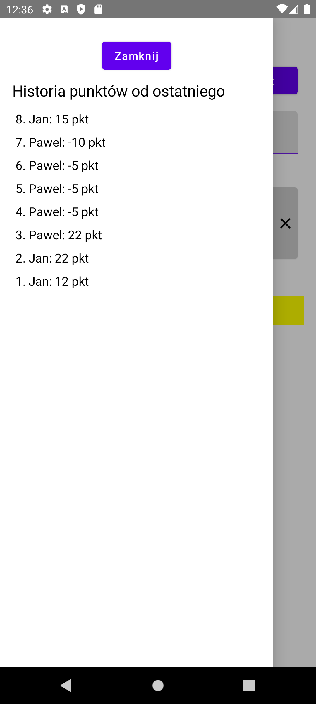

# Triominos Score Counter

A simple Android application for keeping track of scores in the game **Triominos**. The app allows users to add players, input their scores, and automatically calculates the total points. The scorekeeper is designed for quick and easy use during a game session.

## Features
- Add and remove players.
- Input player scores round by round.
- Automatically calculates total points.
- Simple and intuitive user interface.

## Screenshots

### Game Screen

### History List

